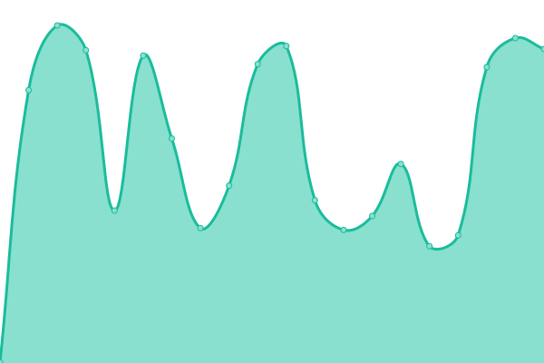

# [📈 Live Status](https://ethanrusz.github.io/status): <!--live status--> **🟩 All systems operational**

This repository contains the open-source uptime monitor and status page for [Em (Ethan) Ruszanowski](https://rusz.dev), powered by [Upptime](https://github.com/upptime/upptime).

With [Upptime](https://upptime.js.org), you can get your own unlimited and free uptime monitor and status page, powered entirely by a GitHub repository. We use [Issues](https://github.com/ethanrusz/status/issues) as incident reports, [Actions](https://github.com/ethanrusz/status/actions) as uptime monitors, and [Pages](https://ethanrusz.github.io/status) for the status page.

<!--start: status pages-->
<!-- This summary is generated by Upptime (https://github.com/upptime/upptime) -->
<!-- Do not edit this manually, your changes will be overwritten -->
<!-- prettier-ignore -->
| URL | Status | History | Response Time | Uptime |
| --- | ------ | ------- | ------------- | ------ |
|  [Forgejo](https://git.rusz.dev) | 🟩 Up | [forgejo.yml](https://github.com/emrusz/status/commits/HEAD/history/forgejo.yml) | 

 449ms
     
 | 

<a href="https://emrusz.github.io/status/history/forgejo">99.81%</a>
    

|  [Grocy](https://grocy.beans.team) | 🟩 Up | [grocy.yml](https://github.com/emrusz/status/commits/HEAD/history/grocy.yml) | 

 638ms
     
 | 

<a href="https://emrusz.github.io/status/history/grocy">100.00%</a>
    

|  [LanguageTool](https://lt.rusz.dev/v2/languages) | 🟩 Up | [language-tool.yml](https://github.com/emrusz/status/commits/HEAD/history/language-tool.yml) | 

 343ms
     
 | 

<a href="https://emrusz.github.io/status/history/language-tool">100.00%</a>
    

|  [Minecraft](https://horseplay.space) | 🟩 Up | [minecraft.yml](https://github.com/emrusz/status/commits/HEAD/history/minecraft.yml) | 

 599ms
     
 | 

<a href="https://emrusz.github.io/status/history/minecraft">100.00%</a>
    

|  [Nextcloud](https://cloud.beans.team) | 🟩 Up | [nextcloud.yml](https://github.com/emrusz/status/commits/HEAD/history/nextcloud.yml) | 

 762ms
     
 | 

<a href="https://emrusz.github.io/status/history/nextcloud">100.00%</a>
    

|  [Piped](https://piped.beans.team) | 🟩 Up | [piped.yml](https://github.com/emrusz/status/commits/HEAD/history/piped.yml) | 

 316ms
     
 | 

<a href="https://emrusz.github.io/status/history/piped">89.51%</a>
    

|  [Rallly](https://rallly.rusz.dev) | 🟩 Up | [rallly.yml](https://github.com/emrusz/status/commits/HEAD/history/rallly.yml) | 

 509ms
     
 | 

<a href="https://emrusz.github.io/status/history/rallly">100.00%</a>
    

|  [rusz.dev](https://rusz.dev) | 🟩 Up | [rusz-dev.yml](https://github.com/emrusz/status/commits/HEAD/history/rusz-dev.yml) | 

 500ms
     
 | 

<a href="https://emrusz.github.io/status/history/rusz-dev">100.00%</a>
    

|  [Vikunja](https://todo.rusz.dev) | 🟩 Up | [vikunja.yml](https://github.com/emrusz/status/commits/HEAD/history/vikunja.yml) | 

 319ms
     
 | 

<a href="https://emrusz.github.io/status/history/vikunja">100.00%</a>
    

<!--end: status pages-->

[**Visit our status website →**](https://emrusz.github.io/status)

## 📄 License

- Powered by: [Upptime](https://github.com/upptime/upptime)
- Code: [MIT](./LICENSE) © [Em (Ethan) Ruszanowski](https://rusz.dev)
- Data in the `./history` directory: [Open Database License](https://opendatacommons.org/licenses/odbl/1-0/)
